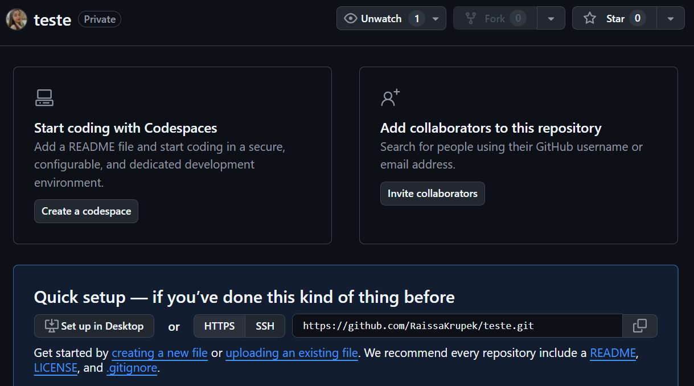
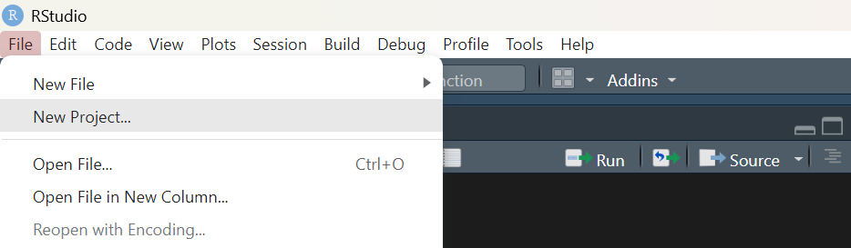
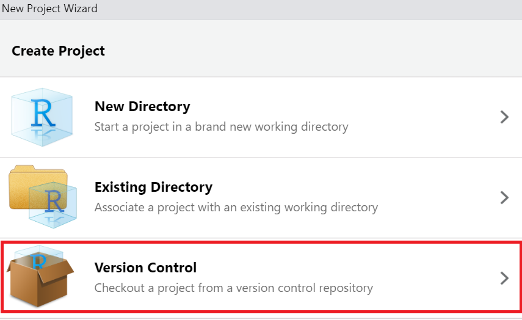
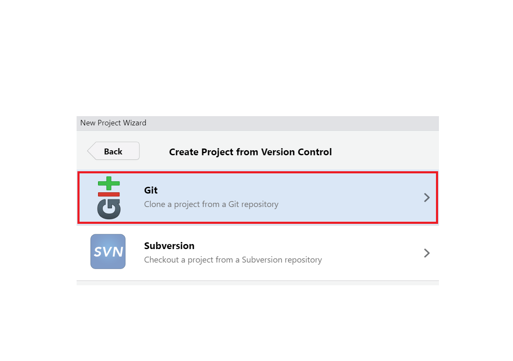
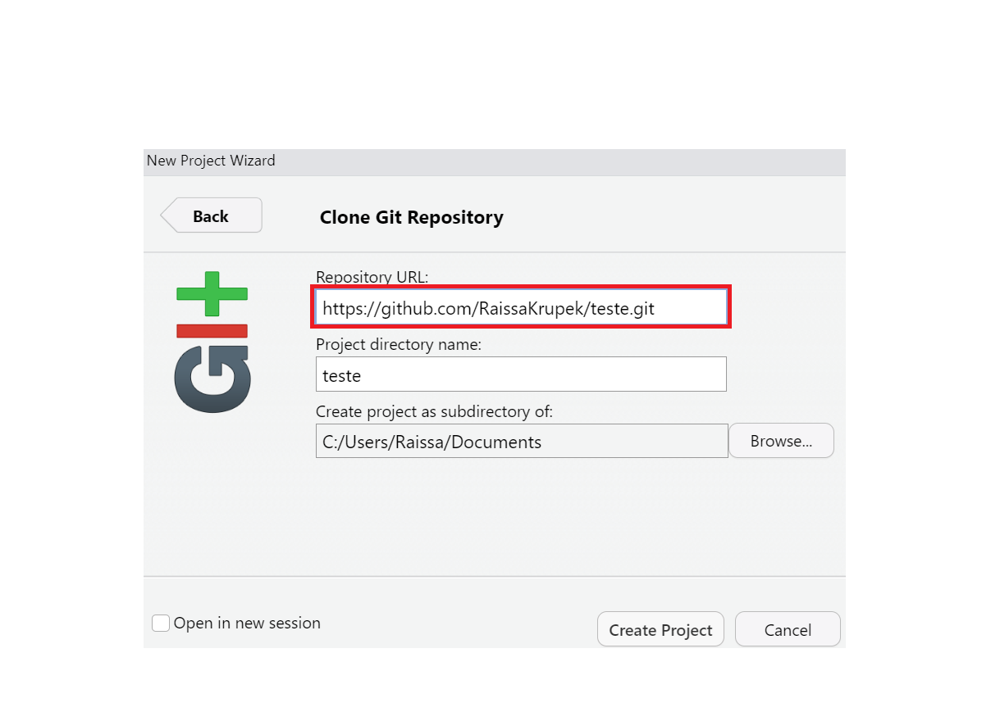
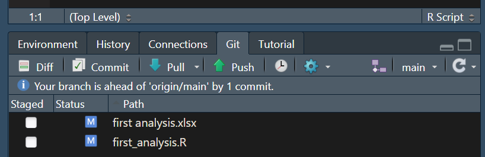
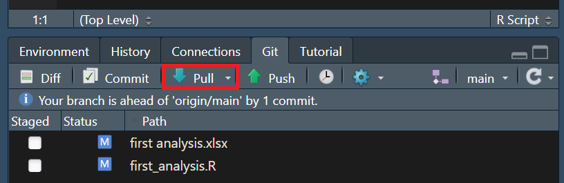

# 👩🏻‍💻Tutorial: Git e Github👩🏻‍💻

Olá!

Este é um guia prático sobre Git e GitHub, gerenciando arquivos pelo **RStudio**. Aqui, você encontrará comandos essenciais, conceitos importantes e um passo a passo para versionar seus projetos de forma eficiente. 🚀

## Por que criei este projeto? 🤓
Criei este repositório para compartilhar um guia prático sobre Git e GitHub, ajudando quem quer aprender a versionar seus projetos sem complicação. A ideia é tornar o processo mais fácil, principalmente para quem está utilizando-os pela primeira vez. Quando estava no início do processo, foram também projetos como estes que me deram grande suporte, então gostaria de passar o conhecimento à frente.

Espero que gostem e que isso ajude no dia a dia de cada um! ☺️

Atensiosamente, Raissa Souza Krupek.

## O que o Git e GitHub fazem? 🧐
Essas ferramentas são responsáveis por gerenciar arquivos e suas versões, funcionando como um `sistema de controle de versão`. Elas permitem o acompanhamento das alterações no código ao longo do tempo. Dessa forma, são essenciais para o armazenamento e restauração de versões, o gerenciamento de backups e para facilitar trabalhos colaborativos. 
Porem, apesar de semelhantes, possuem diferenças importantes:

### 1. Git
  

- O Git é um `sistema de controle de versão`. Ele permite que você registre as mudanças no seu código ao longo do tempo, faça o controle das versões e possa voltar a versões anteriores do código sempre que necessário. Ou seja, ele mantém o histórico de todas as modificações realizadas em arquivos de um projeto e permite que múltiplas pessoas trabalhem no mesmo projeto sem sobrescrever o trabalho dos outros.

- Realize o [download](https://git-scm.com/downloads) do git para prosseguir com o tutorial. Pode ser realizado para os sistemas Windowns, Linux/Unix ou Mac.

### 2. GitHub:
  
  
-  O GitHub é uma plataforma online que usa o Git para armazenar e compartilhar códigos. Ele facilita o trabalho em equipe, permitindo que várias pessoas colaborem no mesmo projeto. No GitHub, você pode ver e organizar os códigos de forma visual, além de usar ferramentas como issues (para discutir problemas ou melhorias), pull requests (para sugerir alterações no código) e wikis (para documentar o projeto). De uma forma informal, pode ser entendido como uma `rede social` para códigos, onde os desenvolvedores podem compartilhá-los e realizar colaborações.
  
-   Para dar continuidade, crie uma conta no [GitHub.](https://github.com)

## Criando um repositório no Github 📁

Em termos simples, um repositório  é como uma pasta ou diretório que guarda tudo o que faz parte de um projeto, incluindo códigos, imagens, documentos, e até arquivos de configuração. Para criar um novo repositório diretamente no Github, siga os seguintes passos:

**1º**- Na página inicial, vá até a opção `Criar novo repositório`

- Nesta etapa, você irá inserir as informações do projeto, como o nome do repositório, adicionar uma descrição breve e, em seguida, `criar o repositório`
- Observação: Se preferir, pode adicionar a opção `README.md`,  um arquivo de texto onde você pode incluir informações importantes sobre o projeto, como o objetivo, como configurar, usar e contribuir para o projeto, entre outros detalhes, sendo uma forma prática de documentar e explicar o projeto para outros usuários.

**2º**- Em seguida, você verá uma página com um visual um pouco cinza e cheia de comandos, mas o que você precisa fazer é bem simples: basta `copiar o link` que aparecer, em HTTPS.

  

## Etapas para obter atualizações remotas do seu código do RStudio 💻

**1º** - Após abrir o RStudio, vá até a opção `File` e, em seguida, selecione `New Project`.
- RStudio → File → New Project
  
  

**2º** - Escolha a opção `Version Control` e depois selecione `Git`.
- Version Control → Git

   

**3º** - Lembra da `URL` que copiamos do repositório criado no GitHub? É aqui que vamos colá-la!
   > ⚠️ Observação: Nesta etapa, pode ser solicitado que você faça o login no GitHub.

   

## Alguns comandos que podem ser necessários 📜
Caso seja preciso configurar uma chave SSH e um personal access token:
### 1. Chave SSH
**Comandos no RStudio:**
- `Vá em Tools` → `Global Options` → `Git/SVN` → `Create SSH key` → `Apply` → `View public key` → copiar → `Ok`.

**Comandos no GitHub:**
- `Settings` → `SSH e GPT keys` → `New SSH` → `Add title` → `Colar Key`. 

### 2. Personal access token
**Comandos no GitHub:**
- `Settings` → `Developer Settings` → `Personal access tokens`  → `tokens (classic)` → `Generate New Token (classic)` → Colocar Note → `habilitar repo` → `Generate token` → `Copiar código`.

**Comandos no RStudio:**

  1 - credentials::set_github_pat("colar seu token aqui")

  2 - rodar isso no RStudio

  3 - instalar os pacotes exigidos

  4 - rodar aquele código novamente

## Sincronizando alterações do R para o Github através do Git 🔄
Depois de fazer as modificações nos arquivos desejados diretamente pelo RStudio, salve as alterações. Em seguida, acesse o environment **Git** do RStudio, e clique em  `Commit`. Selecione os arquivos que deseja incluir na atualização e escreva uma mensagem descritiva explicando as mudanças feitas (etapa opcional). Após isso, clique em `Commit` para registrar as alterações. Por fim, clique em `Push ⬆️` para enviar os arquivos para o repositório remoto.

 

- `Commit` → Selecione arquivos alterados → Escreva uma mensagem de commit (opcional) → `Commit` → `Push`

Observação: Pode ser necessário fazer login no GitHub nesse momento.

## Sincronizando alterações do Github para o R através do Git 🔄
Muitas vezes, fazemos alterações diretamente no GitHub ou em outros servidores, o que pode causar conflitos de sincronização ao tentar fazer novos commits. Isso acontece porque a versão local do código pode estar desatualizada em relação à versão remota. Por isso, é importante sempre sincronizar sua versão local com a remota antes de fazer novos commits. Isso pode ser feito utilizando o comando `Pull ⬇️`, encontrado no ambiente **Git** do RStudio, que traz as alterações mais recentes do repositório remoto para o seu ambiente local, evitando conflitos e garantindo que você esteja trabalhando com a versão mais atualizada do projeto.

## Finalização ✅

O Git e o GitHub têm muitas outras funcionalidades, mas com o que vocês aprenderam hoje, já dá para começar a desenvolver um projeto de um jeito bem bacana! 🚀

Recomendo sempre vocês darem uma olhada na [documentação do Git](https://git-scm.com/doc), pois qualquer dúvida que apareça pode ser respondida por lá na explicação!
